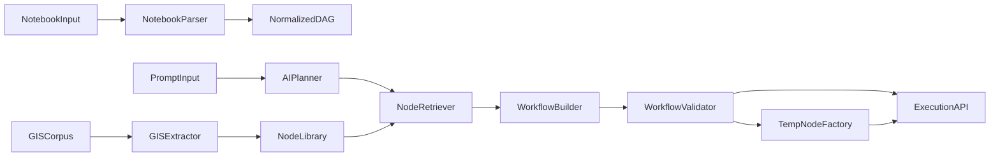

# Workflow AI MVP Plan

## Goals
- Deliver 1-4 as a connected MVP in the existing NotebookFlow app.
- Implement 5 with a hybrid strategy: prefer standard node library; only create temporary nodes when no library match exists.

## Architecture Additions

## Backend Work
- Extend models and API contracts in [backend/app/models.py](../notebookflow/backend/app/models.py) for:
  - notebook ingestion payload (`cells`, metadata)
  - planner request/response (`intent`, `constraints`, `workflow draft`, `advice`)
  - library match confidence + fallback reason
  - temporary node provenance (source prompt / generated code summary)
- Add new endpoints in [backend/app/main.py](../notebookflow/backend/app/main.py):
  - `POST /api/notebook/standardize` (Req #1)
  - `POST /api/workflow/plan` (Req #2/#4)
  - `POST /api/library/gis/import` (Req #3 MVP ingestion)
  - `POST /api/workflow/compose` (Req #4/#5 hybrid composition)
- Create services:
  - `notebook_standardizer.py`: convert notebook cells to normalized nodes/edges (heuristics first: data load, transform, viz, geo).
  - `planner.py`: call OpenAI-compatible API (Gemini/DeepSeek via env-configured base URL/key/model), return workflow draft + suggestions.
  - `node_retriever.py`: score existing specs by task intent + IO compatibility.
  - `workflow_validator.py`: schema/type checks, missing parameter checks, graph sanity checks.
  - `temp_node_factory.py`: generate temporary node spec only when retriever confidence is below threshold.
  - `gis_ingest.py`: convert structured article snippets to candidate node specs with required metadata.
- Keep execution unchanged by reusing existing `run_workflow`/`run_single_node` in [backend/app/workflow_engine.py](../notebookflow/backend/app/workflow_engine.py); composed flows must compile to existing payload shape.

## Frontend Work
- Extend API client in [frontend/src/api/client.ts](../notebookflow/frontend/src/api/client.ts) for new endpoints.
- Add UI entry points in [frontend/src/App.tsx](../notebookflow/frontend/src/App.tsx):
  - Notebook import/standardize modal
  - Prompt-to-workflow panel (goal, constraints, optional data context)
  - Suggestions panel (recommended nodes/alternatives)
- Add components:
  - `NotebookImportModal.tsx` (upload/paste `.ipynb` JSON)
  - `WorkflowPromptPanel.tsx` (prompt-driven generation)
  - `PlanReviewPanel.tsx` (draft workflow + warnings + apply)
- Reuse existing `NodeCreatorModal` as temporary-node editor fallback path; mark temp nodes clearly in labels/category.

## Hybrid Strategy (Req #5)
- Library-first flow:
  1) planner proposes logical steps
  2) retriever maps each step to best existing node spec
  3) validator checks executable completeness
- Temporary-node fallback:
  - Trigger only when no candidate passes confidence threshold or required IO is unsupported.
  - Temp node must include: generated code, required params, rationale, and source prompt fingerprint.
  - Temp node stored separately (not mixed with curated library) and shown as `Temporary` category in UI.

## GIS Node Library MVP (Req #3)
- Define a minimal article ingestion format (title, method, inputs, outputs, pseudo-steps, example params).
- Convert ingestion records to draft node specs and store as “pending” library entries.
- Expose list endpoint to surface these as recommended nodes during planning.

## Validation and Safety
- Add planner response guards:
  - strict JSON schema parsing
  - max node count limits
  - allowed imports/code patterns for temporary nodes
- Add deterministic fallback if planner fails: rule-based template generation using existing node specs.

## Rollout Order
1. Backend contracts + service scaffolding + endpoints.
2. Notebook standardization pipeline (Req #1) and apply-to-canvas.
3. Prompt planner + node retriever + validator (Req #2/#4).
4. Hybrid temporary node fallback (Req #5).
5. GIS ingestion + recommendation integration (Req #3).
6. End-to-end smoke tests and README update.

## Acceptance Criteria
- User can ingest a notebook and get a valid workflow draft executable via existing run endpoint.
- User can enter a prompt and generate/apply a workflow using existing nodes first.
- System creates temporary nodes only when needed and marks them clearly.
- User can import structured GIS article records and see resulting candidate nodes in planner suggestions.
- Generated workflows pass validator and can run without manual JSON edits in most happy-path cases.
